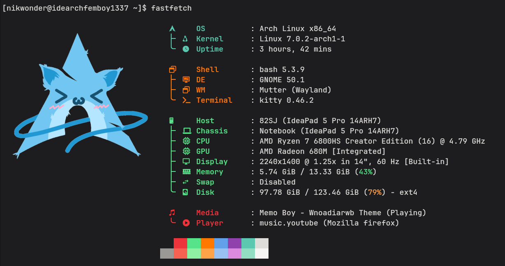
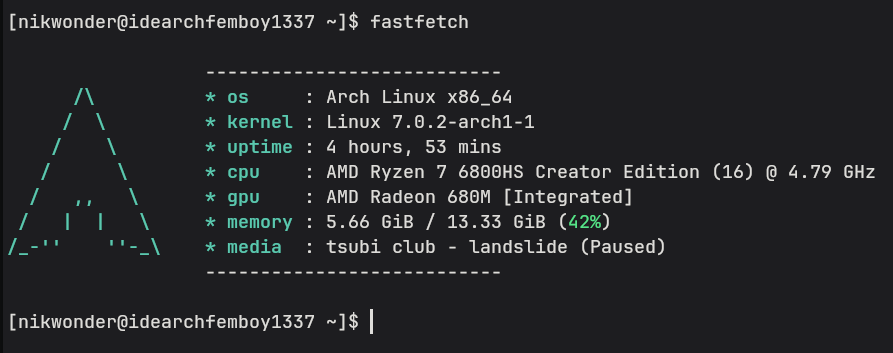
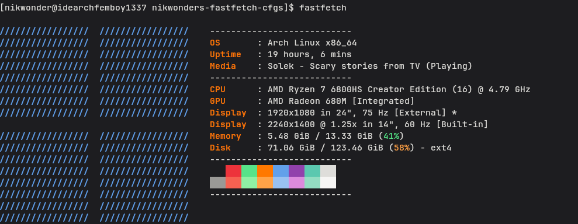
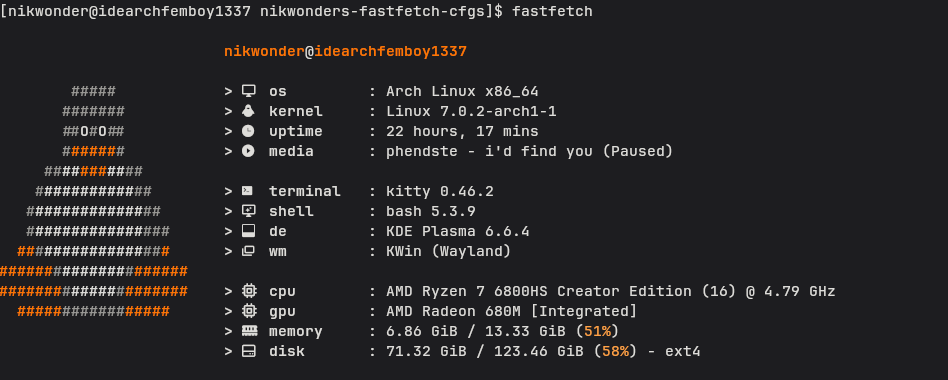

# nikwonder's fastfetch configs
My fastfetch configs that you can steal or borrow freely

<br><hr><br>

# Screenshots
### Nyarch


### Minimal


### Windows 11


### Tux


<br><hr><br>

# How to install
You can either set the theme manually, or clone this repo and use the `install.sh` given (linux only)

## Automatic (linux only)
1. Clone the repo:
```
git clone https://github.com/nikwonder/nikwonders-fastfetch-cfgs.git
```

2. Open the directory:
```
cd nikwonders-fastfetch-cfgs
```

3. Start the script:
```
./install.sh
```

## Manually
1.  Download the config you want
2.  Copy it into the `~/.config/fastfetch/` folder (or don't)
3.  If you want to use it permanently, rename the file to `config.jsonc`<br>
    If you don't, use `fastfetch -c [path to config here]` to use the config once
4.  Done!
